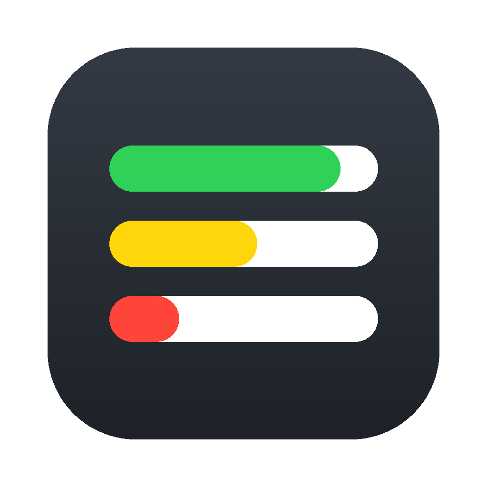
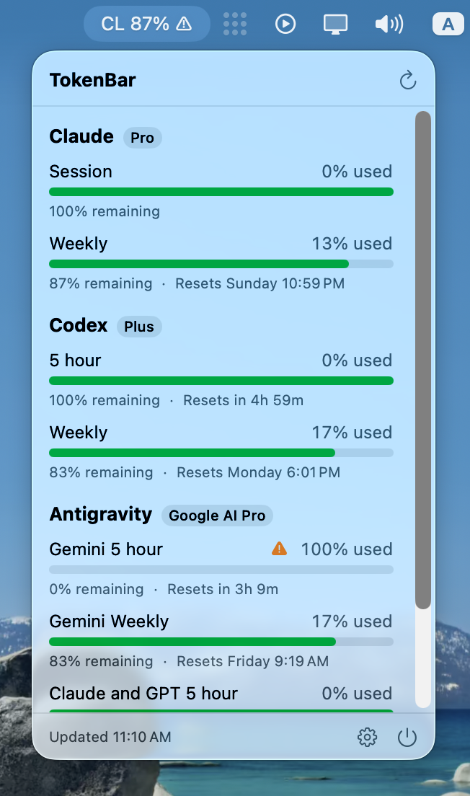

# TokenBar

> Know your AI limits.

A native macOS menu bar app that shows how much AI subscription quota you have
left and when it resets, across Claude Code, Codex, Grok and Antigravity.

No setup: every provider is read through the CLI you already have installed and
signed in.

```
CL 16% ⚠
```

`CL` is Claude, `CX` Codex, `GK` Grok, `AG` Antigravity — the menu bar names whichever
provider is closest to its limit, so the number is never ambiguous about who it
belongs to.



Everything runs locally. There is no TokenBar account, no backend, and no
telemetry. TokenBar never stores provider credentials, reads browser cookies,
or scrapes provider websites — it reuses the authentication your existing CLIs
already have. Grok's compatibility fallback briefly reads the local CLI token
to call the CLI's own billing endpoint; it is never logged or persisted.

## Requirements

macOS 26.5 or later.

After the first Homebrew release, install with:

```sh
brew install --cask amjadjibon/tap/tokenbar
```

## Providers

| Provider | Source | Setup |
| --- | --- | --- |
| Claude | `claude -p "/usage"` | None — uses your installed `claude` |
| Codex | `codex app-server` → `account/rateLimits/read` | None — uses your installed `codex` |
| Grok | `grok agent stdio` → `x.ai/billing` (CLI billing fallback) | None — uses your installed `grok` |
| Antigravity | `agy -p "/usage"` | None — uses your installed `agy` |

Claude and Codex report which plan the account is on, shown as a badge beside
the provider name (`Pro`, `Plus`, `Max`, `Team`…). Claude's comes from
`claude auth status --json`, asked for only after the quota itself parsed, and a
failure there costs the badge rather than the refresh.

Antigravity shows its tier only inside its interactive UI and reports nothing to
a script, so Settings → General has a plan field per provider. Type a plan there
and it becomes that provider's badge; leave it empty to use whatever the
provider reports. A typed label wins over a reported one — you know your own
subscription.

### Claude

Nothing to configure. TokenBar runs:

```sh
claude -p "/usage" --output-format json
```

Claude Code renders that report locally — zero turns, zero tokens, zero cost —
so polling it does not consume the quota it reports on.

The report is prose, so TokenBar parses the `Current …:` lines out of it:

```
Current session: 36% used · resets Sep 1 at 2:29am (Asia/Kuala_Lumpur)
Current week (all models): 5% used · resets Sep 6 at 10:59pm (Asia/Kuala_Lumpur)
```

Everything else in the report is ignored, so changes elsewhere cannot break it,
and a line whose reset stamp is unreadable still contributes its percentage. If
Claude Code ever changes those lines, TokenBar shows an error rather than a
stale or wrong number.

Quota appears for Claude subscription accounts. An API-key account gets a report
with no quota lines, and TokenBar reports the provider as unavailable.

### Grok

Grok has one shared subscription usage pool rather than separate 5-hour and
weekly coding windows. TokenBar uses the period type returned by Grok, so the
bar is normally `Weekly` and will also render a `Monthly` period correctly for
an older or differently configured account.

TokenBar first asks the official CLI over its local ACP transport:

```sh
grok agent stdio  # initialize, authenticate, then x.ai/billing
```

Some stable Grok builds do not yet expose `x.ai/billing` over stdio. For those,
TokenBar reads only the bearer token and user id written by `grok login` to
`~/.grok/auth.json`, sends them to the same
`cli-chat-proxy.grok.com/v1/billing?format=credits` endpoint used by Grok Build,
then immediately discards them. TokenBar never refreshes, copies, logs or caches
the credential. Run `grok login` again if that credential expires.

### Antigravity

Nothing to configure. TokenBar runs:

```sh
agy -p "/usage" --output-format json
```

Also free to poll — zero turns, zero tokens.

Antigravity reports structured JSON rather than prose, and splits its limits by
model family. TokenBar keeps that split rather than averaging it, because the
family about to run out is the one worth knowing about:

```
Gemini 5 hour            42% left
Gemini Weekly            81% left
Claude and GPT 5 hour     7% left   ← the one that actually limits you
Claude and GPT Weekly   100% left
```

Fractions are reported as `0...1` and converted to percentages.

## Menu

The menu lists every enabled provider's quota windows — used and remaining
percentages, a bar, and the reset countdown. Past a certain height the list
scrolls while the header and footer stay pinned, so refresh, settings and quit
stay reachable no matter how many providers are enabled.

After at least 15 minutes of readings in the same quota window, each row also
shows whether observed usage is within the pace needed to last until reset or may
use up the quota early. The estimate compares the change in used percentage
with the remaining percentage and time. It is unavailable when a provider does
not report a reset time, and it is a projection rather than a token count.

Bars read green with half the quota or more left, yellow below that, and red
under 10%. Health is never signalled by colour alone: the percentage, a warning
glyph and the accessibility label all carry it too.

## Settings

- **Providers** — enable or disable each one
- **Refresh** — 1/5/10/15/30 minutes, or manual only (default 5)
- **Menu bar** — the tightest quota across providers (tagged with that
  provider), one chosen provider, or an icon only
- **Plan** — a badge per provider; typed labels win over reported ones
- **Notifications** — warn below 20%, 10% and/or 5%, and when a quota resets
- **Startup** — launch at login

Warnings fire once per quota window, at the tightest threshold crossed. Reset
notices are only sent for a quota you were actually warned about.

## Where things live

```
~/Library/Application Support/TokenBar/
├── settings.json
├── cache/              # last successful reading per provider
└── history/usage.jsonl # appended when a quota actually changes
```

TokenBar reads no other files except Grok's `~/.grok/auth.json` compatibility
fallback described above. Every provider reuses its own CLI sign-in.

## Sandboxing

TokenBar runs outside the macOS app sandbox. It has to: it launches your own
`claude`, `codex`, `grok` and `agy` binaries, which read credentials and config from
your home directory. That does not work from inside a sandbox container. The hardened
runtime stays enabled.

## Development

```sh
xcodebuild -project TokenBar.xcodeproj -scheme TokenBar build
xcodebuild -project TokenBar.xcodeproj -scheme TokenBar \
  -destination 'platform=macOS' test -only-testing:TokenBarTests
```

Provider adapters are tested against sanitized fixtures in
`TokenBarTests/Fixtures/`, so no real CLI is invoked.

## Releasing

Distribution is Developer ID plus notarisation. The Mac App Store is not an
option, because the app is unsandboxed by necessity.

```sh
./scripts/release.sh 1.1.0             # build, notarise, staple, DMG
./scripts/release.sh 1.1.0 --publish   # …and tag and create the GitHub release
./scripts/release.sh 1.1.0 --publish --tap amjadjibon/homebrew-tap
./scripts/release.sh 1.1.0 --skip-notarize --publish --tap amjadjibon/homebrew-tap # prerelease
```

Two one-off prerequisites:

- a **Developer ID Application** certificate, which needs a paid Apple Developer
  Program membership
- `xcrun notarytool store-credentials tokenbar-notary --apple-id <you> --team-id PPQFDGVAM2`

The version comes from the argument and the build number from the commit count,
so a release edits nothing in the project and the same commit rebuilds
identically. The app is stapled in its own right as well as the DMG, so a copy
dragged out of the disk image still launches on a machine that is offline.

`--skip-notarize` runs everything except the round trip to Apple. It is for
checking the pipeline without a certificate; the result will not run on anyone
else's Mac.

## Adding a provider

Conform to `UsageProvider`, convert the native response into `ProviderUsage`,
and register it in `AppState`. The shared model uses an array of `UsageLimit`
rather than provider-specific fields, so a provider can report zero or more
quota windows of any shape.
